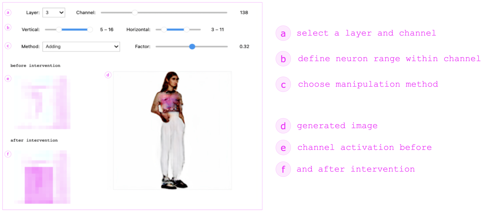

# HIDDEN LAYERS: A GAN-based Prototype Generating Fashion Imagery

Supplementary material for the forthcoming publications:

**Imke Grabe & Tom Jenkins**  
*Hidden Layer Interaction: A Technique to Explore the Material of Generative AI*  
ACM DIS ‘25, July 5–9, 2025, Funchal, Portugal

**Imke Grabe, Jaden Fiotto-Kaufman, David Bau, and Tom Jenkins**  
*Hidden Layers: An Interactive Installation for Exploring the Neural Semantics of Image Synthesis*  
Adjunct proceedings of the Sixth Decennial Aarhus Conference: Computing X Crisis (AAR Adjunct 2025)

---

---

### Try it yourself!

- **Interactive demo on Google Colab:**  
  [Launch the Colab Demo](https://colab.research.google.com/drive/1wNeIf2uVAf179m_q4kqXotMhXof1tQRr?usp=sharing)

- **Run locally:**  
  Download the model checkpoints and place them in this folder before running the code:  
  [FashionGen_s6_i96000.pt](https://drive.google.com/file/d/1gvsgHOVjfjZMCJLmvGeZpHqA31-WZLms/view?usp=sharing)

---

